# Playing with the scheduler

# Grupo 28

Integrantes:

* Agustin Capogrossi (agustin.capogrossi@mi.unc.edu.ar) 

* Lisandro Martinez (ligabriel01.lm@gmail.com)

* Matías Valle (matias.valle@mi.unc.edu.ar)

# Compilación y ejecución

1) Dentro de la carpeta de Xv6 usar el comando "make CPUS=1 qemu-nox" para ejecutar e iniciar el sistema operativo Xv6

# Preguntas

El proceso para el desarrollo de este laboratorio requería mas tiempo de lectura de código que escritura del mismo, los cambios realizados para cada una de las tareas son de solo 1 o 2 líneas de código pero el entendimiento del como usarlas llevó mucho mas tiempo.

Originalmente revisamos el archivo de proc.c en el cual estan definidos todos los procesos del sistema operativo, en la misma encontramos el scheduler original de xv6 y nos dimos al trabajo de identificar cual era el metodo de planeamiento que utilizaba, para ello utilizamos, ademas del material visto en clases, distintas fuentes confiables para entender como es el funcionamiento de los distintos planeadores existentes hasta que redujimos la cantidad de posibilidades. Esto se explica mejor en el ejercicio 1 de la primera parte.

Una vez entendido el scheduler y su proceso empezamos a investigar sus componentes, intentamos entender en que momento se realiza el context switch del mismo y para ello revisamos los archivos aledaños y dependencias, esta búsqueda fue motivada mas por curiosidad que por necesidad puesto que no necesitabamos esa información para realizar la siguiente tarea.

Lo primero a realizar fue añadir a la estructura de los procesos un nuevo campo que recibiera su prioridad, el mismo estaba limitado en el rango de 0 a 2 y cada vez que se creaba un proceso en la función fork le dabamos prioridad máxima, que en nuestro diseño, era el 2, luego revisamos el código en busca de las funciones que nos brindaban información acerca del comienzo y finalización del proceso.

### Primera parte
*1) ¿Qué política utiliza xv6 para elegir el próximo proceso a correr?*

Xv6 utiliza como planificador el algortimo de Round Robin. Originalmente y antes de encontrar el quantum creiamos que el planeador de xv6 era FIFO pues lee los procesos de una lista en el orden en el que son agregados. Posteriormente tras revisar los archivos encontramos que en el "(Agregar nombre de archivo)" se encontraba definido el quantum para cada proceso.

*2) ¿Cuánto dura un quantum en xv6 ?*

El valor predeterminado para un quantum en Linux es de entre 0.75ms a 6ms, pero el organizador de linux es mas complejo que el de xv6. Históricamente, un quantum suele durar entre 1ms y 100ms. En xv6 un quantum dura IRQ_0+IRQ_TIMER, lo cual según el procesador del equipo, puede variar entre 1ms y 10ms.

*3) ¿Hay alguna forma de que a un proceso se le asigne menos tiempo?*
La system call "sys_uptime" devuelve la cantidad de clock ticks que han ocurrido desde que el proceso comenzó, es decir, por cuanto tiempo el proceso se estuvo ejecutando al momento de realizar el llamado a esta system call. Utilizando la función sys_uptime podemos limitar el tiempo asignado a un proceso, utilizando un condicional que detenga el proceso una vez se hayan producido una menor cantidad de ticks de reloj o una vez el proceso ya haya terminado.

# Graficos

### RR

***Standard tick***

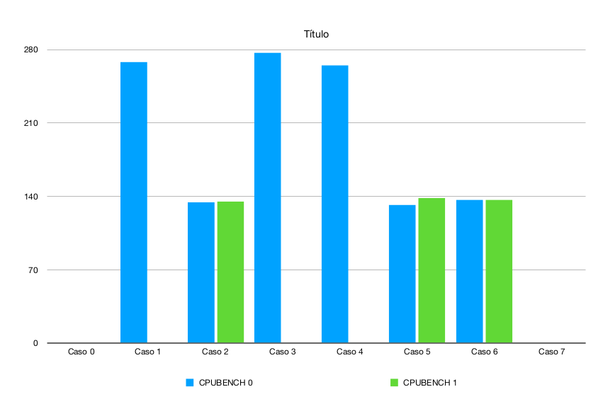	

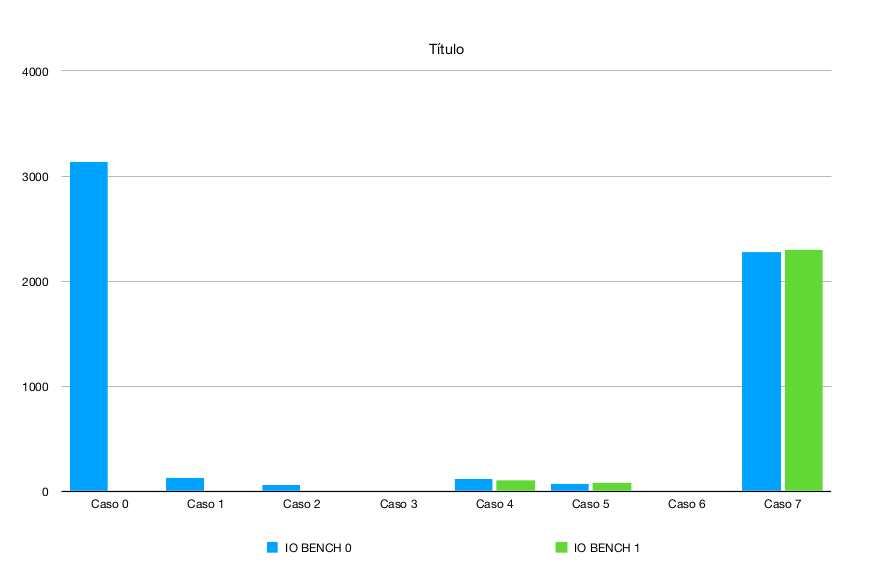

***10 veces menos***

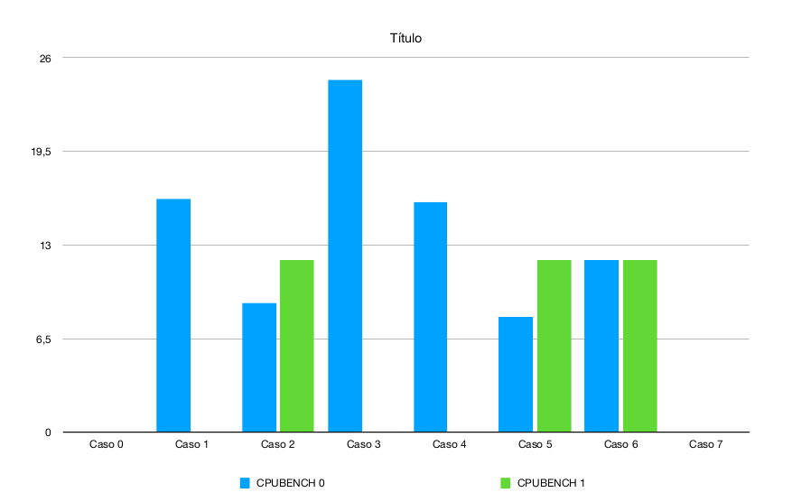														

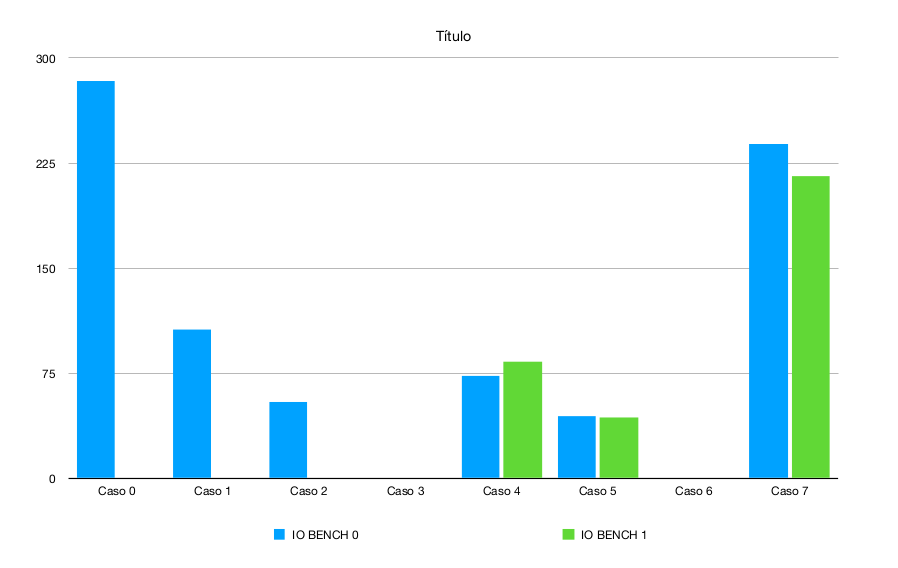

***100 veces menos***

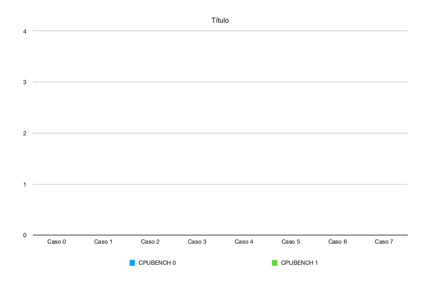														

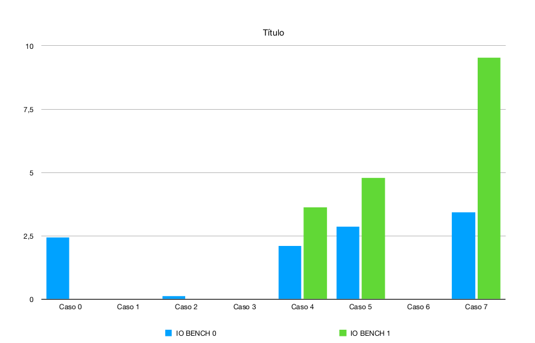

***1000 veces menos***

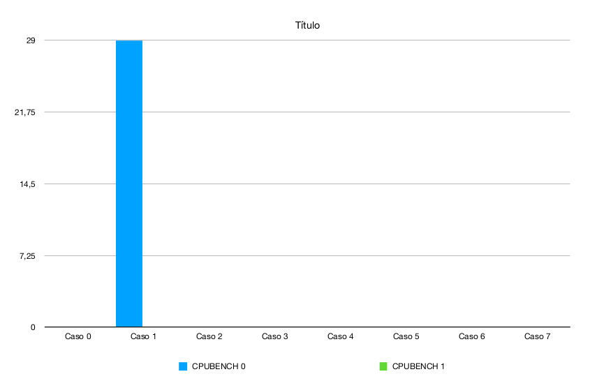														

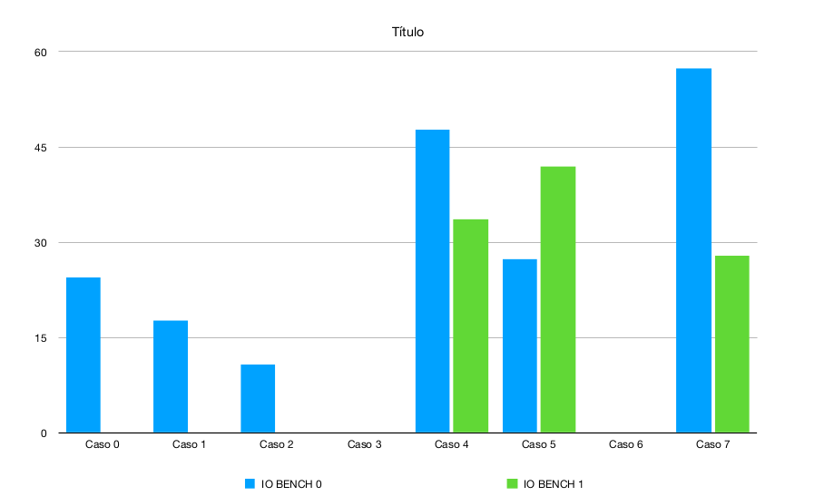

### MLFQ

***Standard tick***

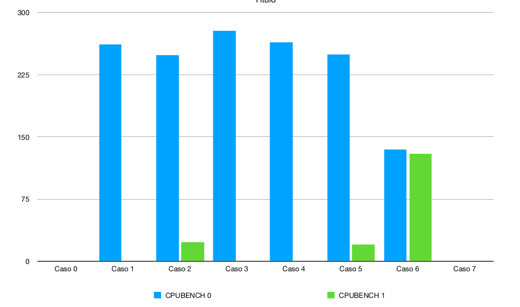														

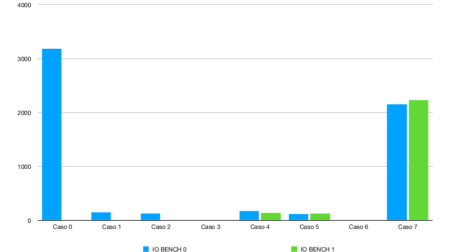

***10 veces menos***

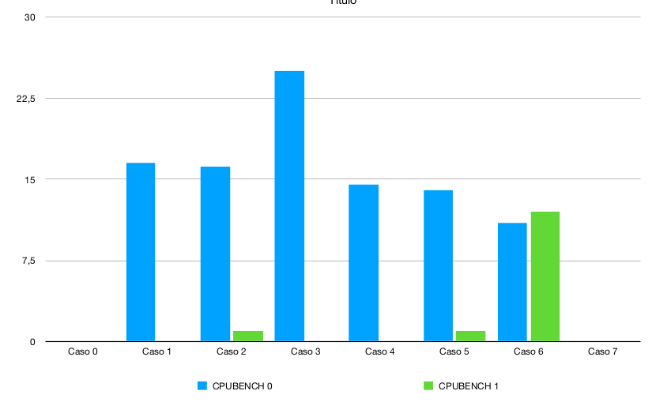														

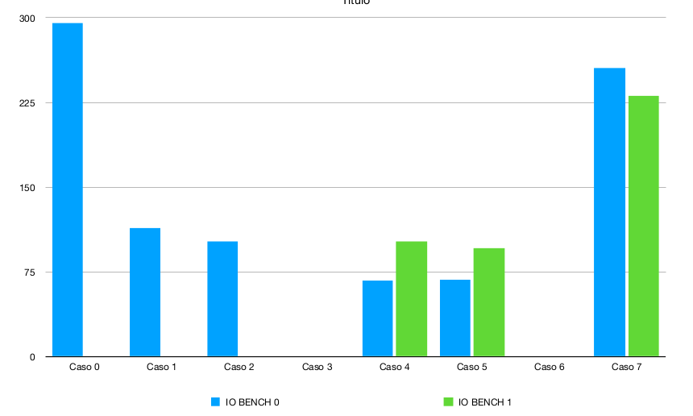

***100 veces menos***

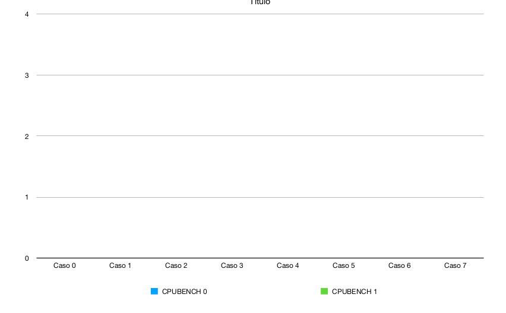														

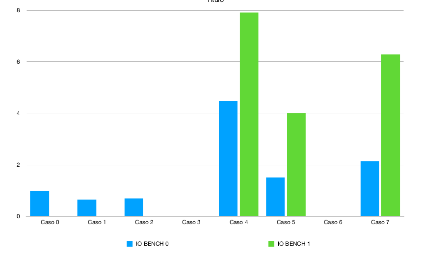

***1000 veces menos***

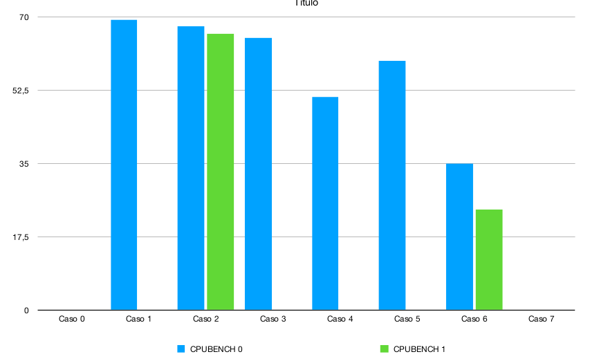														

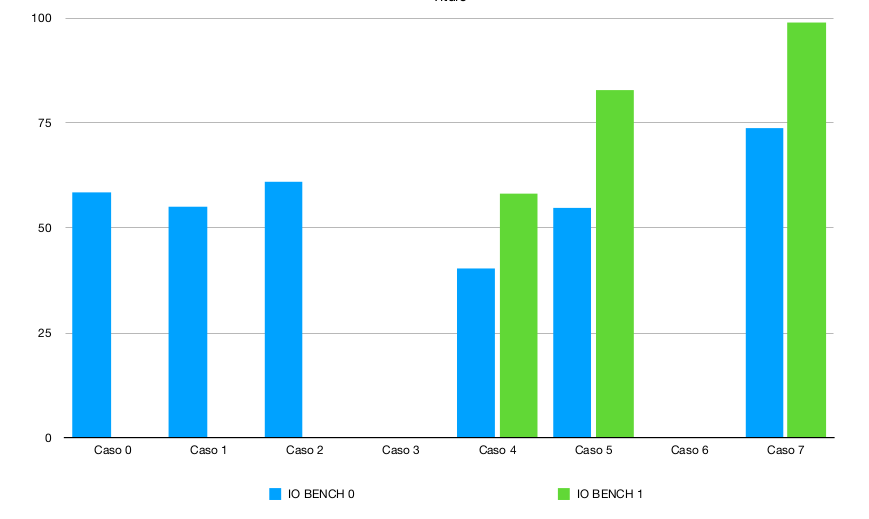

# Cuarta parte

Los resultados producidos con el nuevo modificador MLFQ son mas estables puesto que en el mismo se presentan menos valores extremos que en el planificador RR que se utilizaba previamente
Starvation se produce cuando un proceso de baja prioridad no puede ejecutarse pues un proceso de alta prioridad está consumiendo todos los recursos por un periodo prolongado de tiempo. En esta cola de prioridad, cada vez que un proceso se bloquea aumenta su prioridad, por lo tanto nunca permanece en la posición mínima por un periodo de tiempo prolongado, a su vez, una vez finalizado el quantum asignado a cada proceso, el mismo se suspende, y una vez vuelve a ejecutarse, se reanuda desde donde lo dejó, por lo cual en algún momento el mismo termina.

# Decisiones de diseño

- Se agrego un campo en la estructura "proc" que determina la prioridad qur tiene un proceso.
- Cada vez que un proceso se crea(fork), recibe la prioridad maxima(NPRIO-1).
- Se decidio usar el numero 2 (NPRIO -1) como maxima prioridad para un proceso y 0 como prioridad minima.
- Si un proceso termina antes del quanto que se le proporciona y llama a la funcion sleep(), se le aumentara la prioridad en 1.
- Si un proceso ocupa la CPU durante todo su quanto y se llama a la funcion yield(), para devolver el control al SO, se bajara si prioridad en 1.
- El nuevo Scheduler que trabaja segun el algoritmo MLFQ, funciona de la siguiente manera: dada la tabla de procesos tomamos el primer proceso, y comparamos su prioridad con el resto de procesos de la tabla, el que tenga el mayor prioridad, es el siguente proceso a ejecutae a ejecutar. Una vez que se ejecuto el proceso y vuelva el control al sistema operativo, el procesp ejecutado se manda al final de la tabla de procesos y se vuelve a ejecutar el mismo algoritmo para decidir cual es el proceso siguente a ejecutar(el que tenga mayor prioridad).

NOTA: Si dos procesos tienen la misma prioridad, se ejecutaran con el algoritmo RR.

- Se implemento un priority boost en el scheduler, que funciona de la siguiente manera: Se usa una variable que cuenta el numero de procesos que se han ejecutado hasta el momento, una vez que este llegue a los 300 procesos ejecutados, se elevara la prioridad de los procesos al maximo(NPRIO -1), y la variable que cuenta los procesos ejecutados, volvera a 0 para que vuelva a ocurrir el boost.
